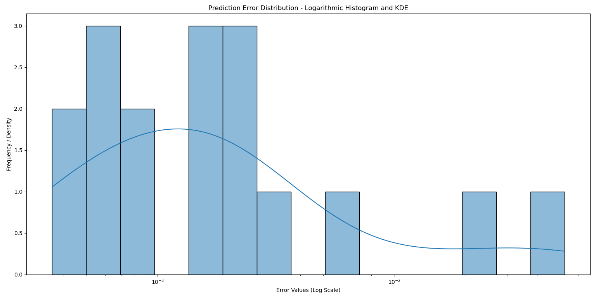

# Sleep Prediction Error Analyzer

This project aims to predict the **total sleep duration (`sleep_total`)** of animals based on various biological features using **Linear Regression**. An essential aspect of this project is analyzing the **distribution of prediction errors** using a **KDE-enhanced histogram**.

---

## Table of Contents
- [Overview](#overview)
- [Dataset](#dataset)
- [Installation](#installation)
- [Model Workflow](#model-workflow)
  - [Handling Missing Values](#handling-missing-values)
  - [Feature Selection](#feature-selection)
  - [Splitting the Data](#splitting-the-data)
  - [Training the Model](#training-the-model)
  - [Making Predictions](#making-predictions)
- [Error Distribution Analysis](#error-distribution-analysis)
- [Visualization](#visualization)
  - [Histogram KDE Plot](#histogram-kde-plot)

---

## Overview

This project utilizes the `msleep.csv` dataset to predict animals' total sleep time using **linear regression**. The critical part of this project is to assess the **accuracy and performance** of the model by visualizing the **error distribution** using a **histogram with a KDE plot**. 

---

## Dataset

The dataset contains sleep and biological data for various species. Below are the key columns used:

- **bodywt**: Body weight (kg)
- **brainwt**: Brain weight (kg)
- **awake**: Awake time (hours per day)
- **sleep_rem**: REM sleep time (hours per day)
- **sleep_total**: Total sleep time (hours per day) (Target Variable)

---

## Installation

Follow the steps below to set up the project:

1. **Clone the Repository:**
   ```bash
   git clone https://github.com/barisgudul/PredictionErrorAnalyzer.git
   cd PredictionErrorAnalyzer

---

## Model Workflow

### Handling Missing Values
```python
We use `SimpleImputer` from `scikit-learn` to fill missing values with the mean for relevant features.

from sklearn.impute import SimpleImputer
import numpy as np

# Initialize the imputer with mean strategy
imputer = SimpleImputer(missing_values=np.nan, strategy="mean")

# Select the subset of the dataset containing missing values
subset = dataset.iloc[:, 6:11].values

# Apply imputation and update the original dataset
dataset.iloc[:, 6:11] = imputer.fit_transform(subset)
```
---

### Feature Selection
We identify the following features for our model:

- **Independent Variables**: `bodywt`, `brainwt`, `awake`, `sleep_rem`
- **Target Variable**: `sleep_total`

---

### Splitting the Data

We split the dataset into training and testing sets using an 80/20 split.

```python
from sklearn.model_selection import train_test_split

# Define features (X) and target (y)
X = dataset[['bodywt', 'brainwt', 'awake', 'sleep_rem']]
y = dataset['sleep_total']


# Split the data into training and testing sets
X_train, X_test, y_train, y_test = train_test_split(X, y, test_size=0.2, random_state=42)
```


---

### Training the Model
We train a linear regression model using the training dataset.

```python
from sklearn.linear_model import LinearRegression

# Initialize the model
model = LinearRegression()

# Train the model on the training data
model.fit(X_train, y_train)
```
---

### Making Predictions
We use the trained model to make predictions on the test dataset.


# Predict the target variable for the test set
```python
y_pred = model.predict(X_test)
```
---

### Calculating Prediction Error
We calculate the absolute error between the actual and predicted values to evaluate the model's performance.


# Create a DataFrame to store the actual and predicted values
```python
test_results = X_test.copy()
test_results['actual_sleep_total'] = y_test
test_results['predicted_sleep_total'] = y_pred
```
# Calculate the absolute error
```python
test_results['error'] = abs(test_results['actual_sleep_total'] - test_results['predicted_sleep_total'])
```
---

## Error Distribution Analysis

After generating predictions, the next step is to analyze the distribution of errors. The absolute error values are calculated by taking the absolute difference between the actual and predicted sleep totals.
```python

test_results['error'] = abs(test_results['actual_sleep_total'] - test_results['predicted_sleep_total'])
```
Analyzing the error distribution helps us understand how well the model performs and where it might be making significant mistakes. We visualize this distribution using a histogram with KDE (Kernel Density Estimate).

---

## Visualization

Below is the logarithmic histogram of the prediction errors with a KDE plot to smooth the distribution curve.

```python
plt.figure(figsize=(15, 8))
sns.histplot(test_results["error"], bins=15, kde=True, log_scale=(True, False))
plt.title('Prediction Error Distribution - Logarithmic Histogram with KDE')
plt.xlabel('Error Values (Log Scale)')
plt.ylabel('Frequency / Density')
plt.show()
```
### Sample Output:

In this plot:

- The histogram shows the frequency of prediction errors.
- The KDE curve smooths the distribution, providing better insights into error patterns.
- A logarithmic scale on the x-axis makes it easier to interpret errors of varying magnitudes.

### Histogram KDE Plot

